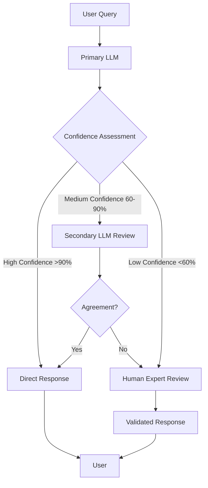

# AI Hallucination Mitigation in Enterprise Applications

> Based on OpenAI's Research: "Why Language Models Hallucinate" (September 4, 2025)

## Executive Summary

OpenAI's research on language model hallucinations reveals that the path to trustworthy AI systems requires not just better models, but a complete rethinking of how we evaluate and incentivize AI behavior. For enterprises deploying AI at scale, this guide provides actionable strategies for mitigating hallucinations through evaluation reform, confidence-aware systems, and multi-tier validation approaches.

## Table of Contents
- [Understanding Hallucinations](#understanding-hallucinations)
- [Root Causes](#root-causes)
- [Core Mitigation Strategies](#core-mitigation-strategies)
- [Enterprise Implementation Path](#enterprise-implementation-path)
- [Multi-Tier Validation Approach](#multi-tier-validation-approach)
- [Practical Examples](#practical-examples)
- [Key Takeaways](#key-takeaways)

## Understanding Hallucinations

Hallucinations are **plausible but false statements generated by language models**, even in response to seemingly straightforward questions. In enterprise contexts, these confident falsehoods pose risks to:
- Decision-making integrity
- Customer trust
- Operational reliability
- Compliance and regulatory requirements

## Root Causes

### 1. Next-Word Prediction Limitations
- Models learn by predicting the next word in vast text corpora
- No explicit "true/false" labels during training
- Arbitrary, low-frequency facts cannot be predicted from patterns alone
- Similar to binary classification errors in traditional ML

### 2. Evaluation Systems That Reward Guessing
**This is the primary cause of persistent hallucinations:**
- Current benchmarks operate like multiple-choice tests
- Blank answers guarantee zero points
- Guessing offers potential reward
- Creates perverse incentives for confident fabrication over honest uncertainty

## Core Mitigation Strategies

### 1. Rethink Evaluation Metrics

#### Traditional Approach (Problematic)
```
Correct Answer: 1 point
Wrong Answer: 0 points
"I don't know": 0 points
Result: Models always guess
```

#### Confidence-Aware Approach (Recommended)
```
Correct Answer: 1 point
Wrong Answer (confident): -2 points
Wrong Answer (uncertain): -0.5 points
"I don't know": 0 points
Result: Models learn to express uncertainty
```

### 2. Implement Confidence Thresholds

Include explicit confidence requirements in prompts:

```python
prompt = """
Answer only if you are >80% confident.
Scoring:
- Correct answers: 1 point
- Incorrect answers: -4 points  
- "I don't know": 0 points

Question: {user_question}
"""
```

### 3. Leverage Post-Training Techniques
- **RLHF** (Reinforcement Learning from Human Feedback)
- **RLAIF** (Reinforcement Learning from AI Feedback)
- **DPO** (Direct Preference Optimization)

These techniques have demonstrated effectiveness in reducing hallucinations when combined with proper evaluation incentives.

## Enterprise Implementation Path

### Phase 1: Assessment (Weeks 1-2)
- Audit current AI evaluation metrics
- Identify high-risk hallucination scenarios
- Establish baseline hallucination rates

### Phase 2: Metric Redesign (Weeks 3-4)
- Update internal benchmarks to reward uncertainty
- Implement confidence-aware scoring
- Create prompt templates with confidence thresholds

### Phase 3: Deployment (Weeks 5-8)
- Roll out updated evaluation framework
- Train models with new incentive structure
- Monitor hallucination rate changes

### Phase 4: Optimization (Ongoing)
- Fine-tune confidence thresholds
- Implement feedback loops
- Scale successful patterns

## Multi-Tier Validation Approach

### Architecture Overview



### Implementation Strategies

#### 1. LLM-as-Judge Pattern
Use a secondary LLM to evaluate the primary model's outputs:

```python
def validate_with_llm_judge(primary_response, confidence_score):
    if confidence_score > 0.9:
        return primary_response
    
    judge_prompt = f"""
    Evaluate the following response for accuracy and confidence:
    Response: {primary_response}
    Stated Confidence: {confidence_score}
    
    Provide:
    1. Accuracy assessment (high/medium/low)
    2. Confidence calibration (appropriate/overconfident/underconfident)
    3. Recommendation (approve/revise/escalate)
    """
    
    judge_assessment = secondary_llm(judge_prompt)
    return process_judge_decision(judge_assessment)
```

#### 2. Human-in-the-Loop Integration
Escalate uncertain cases to human experts:

```python
def handle_uncertainty(response, confidence):
    if confidence < HUMAN_REVIEW_THRESHOLD:
        return {
            "status": "pending_review",
            "message": "This query requires expert verification",
            "draft_response": response,
            "confidence": confidence,
            "escalation_reason": "low_confidence"
        }
```

### Benefits of Multi-Tier Validation

1. **Operational Safety**: Critical decisions get appropriate scrutiny
2. **Trust Building**: Users see transparent uncertainty handling
3. **Continuous Learning**: Feedback loops improve model calibration
4. **Cost Optimization**: Automated handling for high-confidence cases
5. **Compliance**: Audit trail for decision-making process

## Practical Examples

### Customer Service Implementation
```python
class CustomerServiceAI:
    def respond_to_query(self, query):
        response, confidence = self.generate_response(query)
        
        if confidence > 0.85:
            return response
        elif confidence > 0.60:
            return f"I believe {response}, but let me verify with our documentation..."
        else:
            return "I'm not certain about that. Let me connect you with a specialist."
```

### Financial Analysis System
```python
class FinancialAdvisorAI:
    def provide_recommendation(self, market_data):
        prediction, confidence = self.analyze_market(market_data)
        
        if confidence < 0.70:
            return {
                "recommendation": "insufficient_confidence",
                "message": "Market conditions are too uncertain for a reliable prediction",
                "suggestion": "Consult human analyst"
            }
        
        return {
            "recommendation": prediction,
            "confidence": confidence,
            "disclaimer": self.generate_disclaimer(confidence)
        }
```

## Key Takeaways

1. **Hallucinations are learned behavior**, not inevitable technical debt
2. **Evaluation reform is crucial**: Reward uncertainty expression, not just accuracy
3. **Multi-tier validation** provides practical implementation of confidence-aware systems
4. **Enterprise success** requires redefining performance to prioritize reliability
5. **Socio-technical solutions** outperform purely technical approaches

## Metrics for Success

### Traditional Metrics (Insufficient)
- Accuracy rate
- Response time
- Task completion rate

### Recommended Metrics (Comprehensive)
- **Calibration Score**: How well confidence aligns with actual accuracy
- **Abstention Rate**: Percentage of appropriately declined responses
- **False Confidence Rate**: High-confidence incorrect responses
- **Trust Score**: User confidence in system reliability
- **Escalation Efficiency**: Appropriate human-in-loop triggers

## Implementation Checklist

- [ ] Audit current evaluation metrics
- [ ] Design confidence-aware scoring system
- [ ] Implement confidence thresholds in prompts
- [ ] Deploy secondary validation layer (LLM or human)
- [ ] Establish feedback loops for continuous improvement
- [ ] Monitor calibration metrics
- [ ] Document uncertainty handling procedures
- [ ] Train team on new evaluation paradigm

## Conclusion

The shift from rewarding all answers to rewarding right answers and honest uncertainty represents not just technical evolution but organizational maturity in AI adoption. By implementing multi-tier validation systems that combine LLM-based assessment with human oversight, enterprises can build AI systems that know their limits—a foundation for trust that no amount of model scaling alone can achieve.

In the enterprise context, where AI increasingly influences critical decisions, this approach transforms hallucination mitigation from a technical challenge into a competitive advantage through enhanced reliability and trustworthiness.

## References

- OpenAI Research Paper: ["Why Language Models Hallucinate"](https://cdn.openai.com/pdf/d04913be-3f6f-4d2b-b283-ff432ef4aaa5/why-language-models-hallucinate.pdf) (September 4, 2025)
- Related: [AI-Human Collaboration Workflow Guide](./AI_HUMAN_COLLABORATION_WORKFLOW_GUIDE.md)
- Related: [Architecture Evolution Guide](./ARCHITECTURE_EVOLUTION_GUIDE.md)