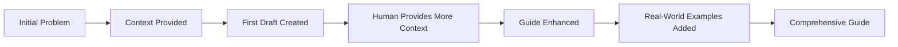
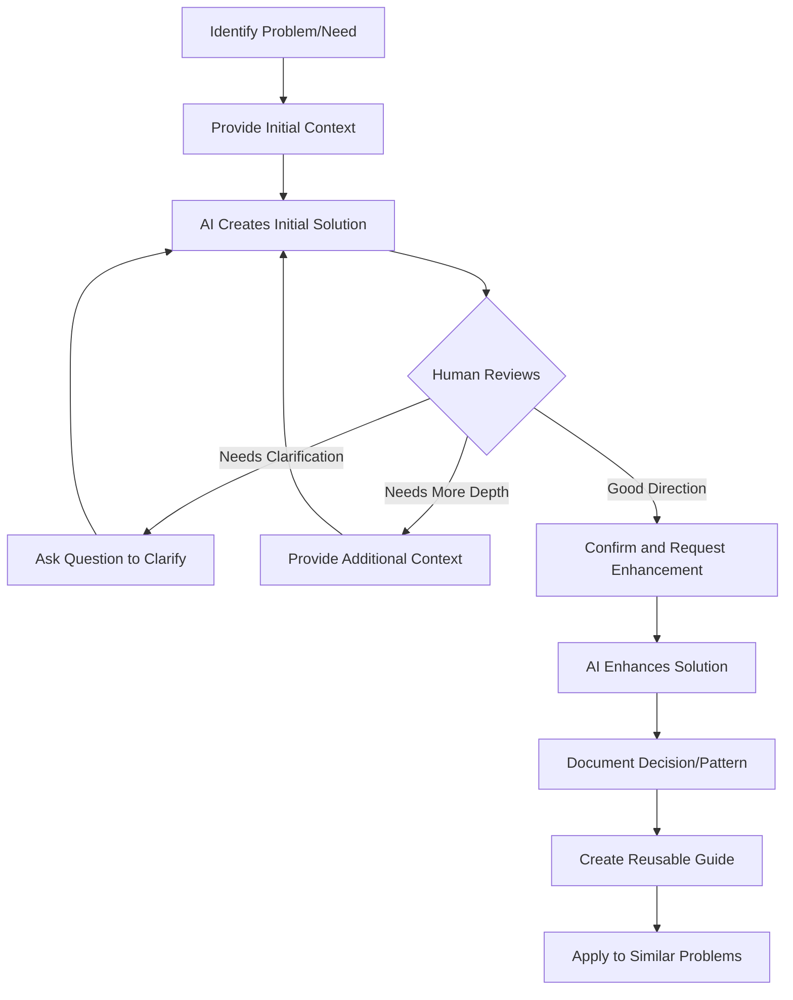

# AI-Human Desktop Review Guide

> 🤝 **A practical guide to effective AI-Human collaboration in architecture and technical decision-making** - based on real-world desktop review sessions that produced 250+ pages of documentation

## Executive Summary

This guide documents the highly effective desktop review process we used to create comprehensive architecture guides, make technical decisions, and solve complex problems. Our session demonstrated how AI and humans can collaborate to produce high-quality technical documentation and architecture patterns.

---

## Table of Contents
1. [What is an AI-Human Desktop Review?](#what-is-an-ai-human-desktop-review)
2. [The Context-First Approach](#the-context-first-approach)
3. [Effective Communication Patterns](#effective-communication-patterns)
4. [The Progressive Elaboration Pattern](#the-progressive-elaboration-pattern)
5. [Decision Documentation Process](#decision-documentation-process)
6. [Real Examples from Our Session](#real-examples-from-our-session)
7. [Best Practices](#best-practices)
8. [Anti-Patterns to Avoid](#anti-patterns-to-avoid)

---

## What is an AI-Human Desktop Review?

An AI-Human Desktop Review is a collaborative process where human expertise and AI capabilities combine to:
- **Explore** complex technical problems
- **Document** architecture patterns and decisions
- **Validate** approaches before implementation
- **Create** comprehensive guides and documentation
- **Learn** from real-world experiences

### Our Session Results
```yaml
Duration: ~3 hours
Output: 250+ pages of documentation
Guides Created: 6 comprehensive architecture guides
Patterns Documented: 15+ enterprise patterns
Value: Months of documentation work completed in hours
```

---

## The Context-First Approach

### Pattern: Progressive Context Building

Our session demonstrated the power of building context progressively:

```yaml
Initial Problem:
  User: "Docker error: python: can't open file '/app/run_http_server.py'"
  
Context Expansion:
  1. Technical Issue → Docker configuration problem
  2. Local Fix → Need for documentation (CLAUDE.md)
  3. Project Docs → Enterprise architecture patterns
  4. Single Pattern → Comprehensive guide collection
  5. Local Repo → New dedicated repository
```

### Key Insight: Context Triggers Valuable Elaboration

When the human provides context instead of just questions, it triggers more valuable responses:

#### ❌ Less Effective:
```
Human: "How should I implement BFF?"
AI: [Generic BFF explanation]
```

#### ✅ Highly Effective (Our Approach):
```
Human: "Context: In stage 1, we assume that SPA (html/javascript/react) 
        will be bundled as part of BFF. This was something we did in our 
        company for simplicity"
        
AI: [Detailed analysis of why this makes sense, evolution path, 
     trade-offs, and complete stage-by-stage guide]
```

---

## Effective Communication Patterns

### 1. The "Context:" Prefix Pattern

Throughout our session, prefixing statements with "Context:" proved highly effective:

```yaml
Examples from Real Sessions:
  - "Context: the organization has partially installed WAF but not consistent"
  - "Context: I like your above reasoning, especially on pain point of e2e full traceability"
  - "Context: OBSERVABILITY_ADOPTION_GUIDE is excellent. while we have implemented both kafka and Kinesis"
```

**Why This Works:**
- Signals that you're providing background, not asking for action
- Allows AI to understand the full picture
- Prevents premature solutions
- Enables more nuanced responses

### 2. The "Question to Clarify" Pattern

Used to validate understanding without triggering extensive rework:

```yaml
Pattern:
  Human: "Question to clarify: [specific point]"
  
Example:
  Human: "Question to clarify: for full scale enterprise stage 4, 
         service mesh can be useful when you have 100+ microservices"
  
Result: Targeted clarification that enhanced the guide without rewriting
```

### 3. The Appreciation-Context-Request Pattern

This three-part pattern was used repeatedly with great success:

```yaml
Structure:
  1. Appreciation: Acknowledge what's working
  2. Context: Provide additional background
  3. Request: Ask for specific enhancement

Example from Session:
  Human: "appreciated. Context: As you state that this is a textbook example 
         of when to apply layered network architecture. we can think of dmz, 
         internal networks, and data networks..."
  
Result: Comprehensive Docker Networking Patterns guide
```

---

## The Progressive Elaboration Pattern

### How Our Guides Evolved

Each guide followed this progression:



### Real Example: Observability Guide Evolution

```yaml
Version 1: Basic OpenTelemetry implementation
  ↓ Human: "Context: we have Kafka and Kinesis"
Version 2: Added multi-generation messaging patterns
  ↓ Human: "Context: pain point of e2e full traceability"
Version 3: Complete guide with Kafka→Kinesis→EventBridge evolution
```

---

## Decision Documentation Process

### The Desktop Review Decision Framework

Our session revealed this effective pattern for architecture decisions:

```yaml
Decision Process:
  1. Present Current State
     Human: "We have partially installed WAF"
     
  2. Explore Pain Points
     Human: "Context: Security team wants full coverage"
     
  3. Document Evolution Path
     AI: Creates staged adoption guide
     
  4. Validate Approach
     Human: "Question to clarify: [specific concern]"
     
  5. Refine and Document
     AI: Enhances with specific details
     
  6. Confirm Alignment
     Human: "I align with your evolutionary path"
```

### Decision Documentation Template (Emerged from Session)

```markdown
## Decision: [Technology/Pattern]

### Current State
- What exists today
- Pain points
- Constraints

### Desired State
- Goals
- Success criteria
- Timeline

### Evolution Path
- Stage 1: Quick wins
- Stage 2: Foundation
- Stage 3: Expansion
- Stage 4: Maturity

### ROI Justification
- Costs at each stage
- Benefits realized
- Payback period
```

---

## Real Examples from Our Session

### Example 1: From Bug Fix to Architecture Repository

```yaml
Starting Point:
  Problem: Docker container error
  
Desktop Review Process:
  1. Fixed immediate issue (restored file)
  2. Human provided context about MCP server
  3. Created CLAUDE.md documentation
  4. Human shared architecture challenges
  5. Created comprehensive guides
  6. Established new repository
  
Outcome:
  - Immediate problem solved
  - 6 architecture guides created
  - New repository established
  - Months of documentation work completed
```

### Example 2: Service Mesh Decision

```yaml
Human Context:
  "for full scale enterprise stage 4, service mesh can be useful 
   when you have 100+ microservices"
  
AI Response Process:
  1. Validated the 100+ threshold
  2. Explained why this number matters
  3. Provided pre-mesh alternatives
  4. Created adoption guide
  5. Included ROI calculations
  
Outcome:
  Complete SERVICE_MESH_ADOPTION_GUIDE.md with:
  - Clear adoption triggers
  - Alternative patterns
  - Migration strategy
  - Cost justification
```

### Example 3: Docker Networking Clarity

```yaml
Human Context:
  "In docker-compose, the python application shows the request is 
   from 172.20.0.1 (not from 127.0.0.1)"
  
Desktop Review Process:
  1. AI explained the networking perspective
  2. Human confirmed understanding
  3. Human requested documentation
  4. AI created comprehensive guide
  
Outcome:
  DOCKER_NETWORKING_PATTERNS.md explaining:
  - Why 172.20.0.1 vs 127.0.0.1
  - Complete networking patterns
  - Debugging workflows
  - Best practices
```

---

## Best Practices

### For Humans

#### 1. Provide Rich Context
```yaml
DO:
  - Share real-world constraints
  - Explain what you've already tried
  - Describe your team/organization stage
  - Include actual metrics/numbers

DON'T:
  - Ask generic questions
  - Withhold relevant background
  - Request solutions without context
```

#### 2. Use Progressive Disclosure
```yaml
Pattern:
  Start: Core problem
  Then: Add organizational context
  Then: Share constraints
  Then: Provide examples
  Finally: Request specific help
```

#### 3. Validate and Iterate
```yaml
Process:
  1. Review initial response
  2. Provide additional context
  3. Ask clarifying questions
  4. Confirm understanding
  5. Request refinements
```

### For AI Assistants

#### 1. Listen for Context Cues
```yaml
Context Indicators:
  - "In our organization..."
  - "We've tried..."
  - "Our challenge is..."
  - "Context:"
  - "Question to clarify:"
```

#### 2. Build Progressively
```yaml
Response Structure:
  1. Acknowledge the context
  2. Validate the approach
  3. Provide staged solution
  4. Include real-world considerations
  5. Add ROI/justification
```

#### 3. Connect Dots
```yaml
Pattern Recognition:
  - Link related problems
  - Identify patterns across contexts
  - Suggest comprehensive solutions
  - Create reusable guides
```

---

## Anti-Patterns to Avoid

### ❌ The Solution-First Anti-Pattern
```yaml
Human: "We need Kubernetes"
AI: [Implements Kubernetes]

Problem: Skips understanding WHY and WHERE you are in journey
```

### ❌ The Perfect-World Anti-Pattern
```yaml
Human: "Best practice for microservices?"
AI: [Describes ideal end-state]

Problem: Ignores current reality and migration path
```

### ❌ The Context-Free Anti-Pattern
```yaml
Human: "Fix my observability"
AI: [Generic observability guide]

Problem: Misses specific pain points and constraints
```

### ❌ The Big-Bang Anti-Pattern
```yaml
Human: "Modernize our architecture"
AI: [Complete rewrite plan]

Problem: Ignores incremental evolution needs
```

---

## The Desktop Review Workflow

### Our Proven Workflow



### Time Investment vs. Value

```yaml
Our Session Metrics:
  Time Invested: ~3 hours
  Documentation Created: 250+ pages
  Patterns Documented: 15+
  Reusable Guides: 6
  
Traditional Approach:
  Time Required: 2-3 months
  Multiple meetings: 20+
  Documentation debt: High
  Knowledge transfer: Limited
```

---

## Success Metrics

### How to Measure Effective Desktop Reviews

```yaml
Quantitative Metrics:
  - Documentation created (pages/guides)
  - Decisions documented
  - Problems solved
  - Time saved vs traditional approach
  - Reusable artifacts created

Qualitative Metrics:
  - Clarity of understanding achieved
  - Alignment on approach
  - Confidence in decisions
  - Knowledge transfer effectiveness
  - Team buy-in level
```

### Our Session Results

```yaml
Problems Solved:
  ✅ Docker configuration issue
  ✅ Architecture documentation gap
  ✅ Service mesh adoption decision
  ✅ Observability strategy
  ✅ WAF implementation approach
  ✅ BFF pattern clarity
  ✅ Multi-generation system migration

Artifacts Created:
  ✅ 6 comprehensive guides
  ✅ 1 new repository structure
  ✅ 15+ documented patterns
  ✅ Multiple decision frameworks
  ✅ ROI calculators
  ✅ Migration strategies
```

---

## Tips for Your First Desktop Review

### Preparation Checklist

```yaml
Before the Session:
  ☐ Identify core problem/need
  ☐ Gather relevant context
  ☐ Document current state
  ☐ List constraints
  ☐ Prepare examples
  ☐ Define success criteria

During the Session:
  ☐ Start with immediate problem
  ☐ Provide context progressively
  ☐ Ask clarifying questions
  ☐ Validate understanding
  ☐ Request specific enhancements
  ☐ Document decisions

After the Session:
  ☐ Review all artifacts
  ☐ Organize documentation
  ☐ Share with team
  ☐ Plan implementation
  ☐ Schedule follow-up if needed
```

### Starting Templates

#### Opening Context Template
```
Context: We are a [stage] company with [size] engineering team.
We currently have [current state].
Our challenge is [specific problem].
We've tried [previous attempts].
Our constraints are [limitations].
We need help with [specific ask].
```

#### Clarification Template
```
Question to clarify: You mentioned [concept].
In our context, we have [specific situation].
Would [specific approach] make sense?
```

#### Enhancement Request Template
```
This is excellent. 
Context: In our situation, we also have [additional factor].
Could you enhance this to address [specific need]?
```

---

## Advanced Patterns

### The Context-Zoom Pattern

Used effectively in our session to move from specific to general:

```yaml
Zoom Levels:
  1. Specific Problem (Docker error)
     ↓
  2. Component Level (MCP server)
     ↓
  3. Project Level (Documentation needs)
     ↓
  4. Architecture Level (Evolution patterns)
     ↓
  5. Enterprise Level (Multi-system patterns)
```

### The Experience-Validation Pattern

Sharing real experience to validate and enhance recommendations:

```yaml
Pattern:
  Human: [Shares real experience]
  AI: [Validates and explains why it makes sense]
  Human: [Confirms alignment]
  AI: [Documents as pattern]

Example:
  Human: "We bundled SPA with BFF for simplicity"
  AI: "This is actually a smart pattern for MVP stage because..."
  Result: Documented in BFF_PATTERN_GUIDE.md
```

### The Pain-Point-to-Pattern Pipeline

Converting problems into reusable patterns:

```yaml
Pipeline:
  Pain Point: "Can't trace across Kafka and Kinesis"
     ↓
  Context: "We have three generations of messaging"
     ↓
  Solution: "Unified message format with trace propagation"
     ↓
  Pattern: "Multi-Generation System Migration"
     ↓
  Guide: OBSERVABILITY_ADOPTION_GUIDE.md (enhanced)
```

---

## Conclusion

### The Power of Context-Rich Collaboration

Our desktop review session demonstrated that when humans provide rich context and AI responds with comprehensive, staged solutions, the result exceeds what either could achieve alone:

```yaml
Human Brings:
  - Real-world context
  - Organizational constraints  
  - Domain expertise
  - Validation of approaches
  - Priority and focus

AI Brings:
  - Pattern recognition
  - Comprehensive documentation
  - Multiple perspectives
  - Rapid iteration
  - Consistent structure

Together Create:
  - Pragmatic solutions
  - Complete documentation
  - Validated approaches
  - Reusable patterns
  - Accelerated decisions
```

### Key Success Factors

1. **Context is King**: The more context provided, the better the output
2. **Progressive Elaboration**: Build understanding iteratively
3. **Validate and Refine**: Use clarifying questions to ensure alignment
4. **Document Everything**: Transform discussions into reusable guides
5. **Think in Patterns**: Extract reusable patterns from specific problems

### Final Thought

The most effective AI-Human desktop reviews don't try to solve everything at once. They start with immediate problems, build context progressively, and create comprehensive solutions that can be reused across the organization.

---

## Quick Reference Card

### Desktop Review Phrases That Work

```yaml
Starting:
  - "Context: We are..."
  - "Our current situation is..."
  - "The problem we're facing is..."

Clarifying:
  - "Question to clarify:..."
  - "In our context..."
  - "Would it make sense to..."

Enhancing:
  - "This is excellent. Additionally..."
  - "Context: We also have..."
  - "Could you elaborate on..."

Validating:
  - "I align with..."
  - "This matches our experience..."
  - "Correct, and also..."

Concluding:
  - "Let's document this as..."
  - "We should create a guide for..."
  - "This will help others who..."
```

### Session Checklist

```yaml
☐ Start with specific problem
☐ Provide organizational context
☐ Share constraints and history
☐ Ask clarifying questions
☐ Validate approaches
☐ Request specific enhancements
☐ Document patterns
☐ Create reusable guides
☐ Plan next steps
```

---

*Based on an actual AI-Human desktop review session that produced 6 comprehensive architecture guides and established a new documentation repository in under 3 hours.*