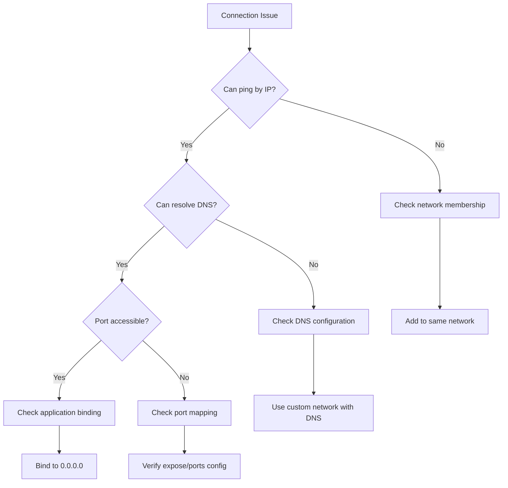

# Docker Networking Patterns for Layered Architecture

## Executive Summary

This guide demystifies Docker networking for layered architectures, explaining how containers communicate, why you see different IP addresses (172.20.0.1 vs 127.0.0.1), and how to implement secure network segmentation for enterprise applications.

---

## Table of Contents
1. [Understanding Docker Networks](#understanding-docker-networks)
2. [The IP Address Mystery Solved](#the-ip-address-mystery-solved)
3. [Layered Architecture with Docker Networks](#layered-architecture-with-docker-networks)
4. [Network Security Patterns](#network-security-patterns)
5. [Service Discovery Evolution](#service-discovery-evolution)
6. [Debugging Network Issues](#debugging-network-issues)
7. [Best Practices](#best-practices)

---

## Understanding Docker Networks

### Docker Network Types

```yaml
Network Drivers:
  bridge:     Default network driver, isolated network on single host
  host:       Container uses host's network directly (no isolation)
  overlay:    Multi-host networking for Swarm/Kubernetes
  macvlan:    Assigns MAC address, appears as physical device
  none:       No networking, complete isolation
```

### Default Bridge Network

When you run a container without specifying a network, Docker uses the default bridge:

```bash
# Default behavior
docker run nginx

# What actually happens:
# 1. Container connects to 'bridge' network
# 2. Gets IP like 172.17.0.2
# 3. Can reach internet via NAT
# 4. Other containers on bridge can reach it
```

### Custom Bridge Networks (Recommended)

```yaml
# docker-compose.yml
version: '3'
services:
  web:
    image: nginx
    networks:
      - frontend-net
  
  api:
    image: myapi
    networks:
      - frontend-net
      - backend-net
  
  database:
    image: postgres
    networks:
      - backend-net

networks:
  frontend-net:
    driver: bridge
  backend-net:
    driver: bridge
```

**Why custom networks?**
- Automatic DNS resolution by service name
- Better isolation
- Easy to connect/disconnect containers
- Network-scoped service discovery

---

## The IP Address Mystery Solved

### Why 172.20.0.1 Instead of 127.0.0.1?

This was a key insight from our discussion. Here's the complete picture:

```
Your Host Machine
│
├── 127.0.0.1 (localhost on host)
│   └── Your applications see this
│
├── 172.20.0.1 (Docker bridge gateway)
│   └── What containers see as "host"
│
└── Docker Network (172.20.0.0/16)
    ├── Container A: 172.20.0.2
    │   └── 127.0.0.1 (its own localhost)
    ├── Container B: 172.20.0.3
    │   └── 127.0.0.1 (its own localhost)
    └── Container C: 172.20.0.4
        └── 127.0.0.1 (its own localhost)
```

### Real-World Example

```yaml
# When your app connects to localhost:8600
Host Machine (You) → localhost:8600
         ↓
Docker Port Mapping (8600:8600)
         ↓
Container receives from: 172.20.0.1
         ↓
Container's service listening on: 0.0.0.0:8600
```

### Perspective Matters

| From | To | IP Seen | Why |
|------|-----|---------|-----|
| Host | Container | localhost:8600 works | Docker port mapping |
| Container | Self | 127.0.0.1 | Container's own localhost |
| Container | Host | 172.20.0.1 | Gateway IP |
| Container | Container | 172.20.0.x | Container's network IP |
| Container Logs | Incoming from host | 172.20.0.1 | Source is gateway |

---

## Layered Architecture with Docker Networks

### Classic 3-Tier Architecture

Based on our discussion about SPA→BFF→API→Database patterns:

```yaml
# docker-compose.yml for layered architecture
services:
  # Presentation Layer
  spa:
    build: ./frontend
    networks:
      - public-net
    ports:
      - "80:80"
    environment:
      - API_URL=http://bff:3000

  # Application Layer (BFF)
  bff:
    build: ./bff
    networks:
      - public-net     # Can talk to SPA
      - private-net    # Can talk to APIs
    environment:
      - API_GATEWAY=http://api:8080
      - REDIS_URL=redis://cache:6379

  # API Layer
  api:
    build: ./api
    networks:
      - private-net    # Can talk to BFF
      - data-net       # Can talk to Database
    environment:
      - DB_HOST=postgres
      - CACHE_HOST=cache

  # Caching Layer
  cache:
    image: redis:alpine
    networks:
      - private-net    # Accessible from BFF and API

  # Data Layer
  postgres:
    image: postgres:15
    networks:
      - data-net       # Only API can access
    volumes:
      - db-data:/var/lib/postgresql/data

networks:
  public-net:
    driver: bridge
    ipam:
      config:
        - subnet: 172.20.0.0/24
  
  private-net:
    driver: bridge
    ipam:
      config:
        - subnet: 172.21.0.0/24
  
  data-net:
    driver: bridge
    internal: true  # No external access
    ipam:
      config:
        - subnet: 172.22.0.0/24

volumes:
  db-data:
```

### Network Segmentation Benefits

```yaml
Security Boundaries:
  public-net:
    - Internet-facing services
    - Load balancers
    - Static content servers
    
  private-net:
    - Internal APIs
    - Application services
    - Cache layers
    
  data-net:
    - Databases
    - Data stores
    - Internal only (no internet route)
```

### Microservices Architecture Pattern

For our discussion about 100+ microservices:

```yaml
# Advanced microservices networking
services:
  # API Gateway
  kong:
    image: kong
    networks:
      - edge-net
      - gateway-net
    ports:
      - "8000:8000"
      - "8443:8443"

  # BFF for different clients
  web-bff:
    build: ./bff-web
    networks:
      - gateway-net
      - mesh-net
    deploy:
      replicas: 3

  mobile-bff:
    build: ./bff-mobile
    networks:
      - gateway-net
      - mesh-net
    deploy:
      replicas: 2

  # Microservices
  user-service:
    build: ./services/user
    networks:
      - mesh-net
      - data-net
    labels:
      - "service.group=core"

  order-service:
    build: ./services/order
    networks:
      - mesh-net
      - event-net
    labels:
      - "service.group=core"

  payment-service:
    build: ./services/payment
    networks:
      - mesh-net
      - payment-net  # Isolated for PCI compliance
    labels:
      - "service.group=critical"

  # Event Streaming
  kafka:
    image: confluentinc/cp-kafka
    networks:
      - event-net
    
  # Databases
  postgres-users:
    image: postgres
    networks:
      - data-net
      
  postgres-orders:
    image: postgres
    networks:
      - data-net

networks:
  edge-net:        # Internet facing
  gateway-net:     # API Gateway layer
  mesh-net:        # Service mesh
  event-net:       # Event streaming
  data-net:        # Databases
    internal: true
  payment-net:     # PCI compliance
    internal: true
```

---

## Network Security Patterns

### Defense in Depth

Based on our WAF and security discussions:

```yaml
# Security-focused network design
services:
  # Layer 1: Edge Security
  waf:
    image: modsecurity
    networks:
      - internet-net
      - dmz-net
    ports:
      - "443:443"

  # Layer 2: API Gateway
  api-gateway:
    image: kong
    networks:
      - dmz-net
      - app-net
    # No direct internet exposure

  # Layer 3: Application
  application:
    build: ./app
    networks:
      - app-net
      - db-net
    # Two layers from internet

  # Layer 4: Database
  database:
    image: postgres
    networks:
      - db-net
    # Three layers from internet, internal network

networks:
  internet-net:
    driver: bridge
    
  dmz-net:
    driver: bridge
    internal: false
    
  app-net:
    driver: bridge
    internal: false
    
  db-net:
    driver: bridge
    internal: true  # Cannot reach internet
```

### Zero Trust Implementation

```yaml
# Implementing zero trust with Docker networks
services:
  service-a:
    image: service-a
    networks:
      service-a-net:
        aliases:
          - service-a-internal
    cap_drop:
      - ALL
    read_only: true
    security_opt:
      - no-new-privileges:true

  service-b:
    image: service-b
    networks:
      service-b-net:
        aliases:
          - service-b-internal
      service-a-net:  # Explicit permission to talk to service-a

networks:
  service-a-net:
    internal: true
  service-b-net:
    internal: true
```

---

## Service Discovery Evolution

### Stage 1: Hard-coded IPs (Don't do this!)

```yaml
# ❌ Anti-pattern
services:
  app:
    environment:
      - DB_HOST=172.20.0.5  # Will break!
```

### Stage 2: Docker DNS

```yaml
# ✅ Docker's built-in DNS
services:
  app:
    environment:
      - DB_HOST=postgres  # Resolves automatically
    networks:
      - mynet
  
  postgres:
    networks:
      - mynet
```

### Stage 3: Service Discovery Tools

```yaml
# Consul for service discovery
services:
  consul:
    image: consul
    networks:
      - discovery-net
    ports:
      - "8500:8500"
    
  app:
    image: myapp
    networks:
      - discovery-net
    environment:
      - CONSUL_HOST=consul
    depends_on:
      - consul
```

### Stage 4: Service Mesh

```yaml
# Istio sidecar pattern
services:
  app:
    image: myapp
    networks:
      - mesh-net
      
  app-sidecar:
    image: istio/proxy
    networks:
      - mesh-net
    # Handles all network traffic for app
```

---

## Debugging Network Issues

### Essential Commands

```bash
# 1. Inspect network details
docker network inspect bridge
docker network inspect <network_name>

# 2. See container's network config
docker inspect <container> | grep -A 20 NetworkMode

# 3. Test connectivity between containers
docker exec container-a ping container-b

# 4. Check exposed ports
docker port <container>

# 5. See network interfaces in container
docker exec <container> ip addr show

# 6. Check routing table
docker exec <container> ip route

# 7. DNS resolution test
docker exec <container> nslookup <service-name>

# 8. Network statistics
docker exec <container> netstat -tulpn

# 9. Trace network path
docker exec <container> traceroute <destination>

# 10. Monitor network traffic
docker exec <container> tcpdump -i eth0
```

### Common Issues and Solutions

```yaml
Issue: "Connection refused"
Causes:
  - Service not listening on 0.0.0.0 (listening on 127.0.0.1)
  - Wrong port
  - Network isolation
Solution:
  - Bind to 0.0.0.0 not 127.0.0.1
  - Verify port mapping
  - Ensure containers on same network

Issue: "Cannot resolve hostname"
Causes:
  - Containers on different networks
  - Using container name instead of service name
  - Default bridge network (no automatic DNS)
Solution:
  - Use custom networks
  - Use service name from docker-compose
  - Connect containers to same network

Issue: "Timeout connecting to database"
Causes:
  - Database on internal network
  - Firewall rules
  - Network segmentation
Solution:
  - Check network connectivity
  - Verify network membership
  - Review security groups

Issue: "Random connection failures"
Causes:
  - Container recreation with different IP
  - DNS cache issues
  - Network driver issues
Solution:
  - Use service names not IPs
  - Implement retry logic
  - Update Docker/network drivers
```

### Network Debugging Workflow



---

## Best Practices

### 1. Network Design Principles

```yaml
Principles:
  Least Privilege:
    - Services only on required networks
    - Internal networks for sensitive data
    - Explicit network membership
    
  Segmentation:
    - Separate networks per tier
    - Isolate critical services
    - Use internal networks for databases
    
  Documentation:
    - Document network topology
    - Label networks clearly
    - Maintain network diagrams
```

### 2. Naming Conventions

```yaml
Network Naming:
  Purpose-based:
    - frontend-net
    - backend-net
    - database-net
    
  Environment-based:
    - dev-net
    - staging-net
    - prod-net
    
  Service-based:
    - payment-net
    - auth-net
    - analytics-net
```

### 3. Security Best Practices

```yaml
Security Checklist:
  ✓ Use custom networks (not default bridge)
  ✓ Implement network segmentation
  ✓ Use internal networks for databases
  ✓ Limit exposed ports
  ✓ Use secrets management for credentials
  ✓ Implement network policies (in Kubernetes)
  ✓ Regular security scanning
  ✓ Monitor network traffic
```

### 4. Performance Optimization

```yaml
Performance Tips:
  - Use host network for high-performance needs
  - Minimize network hops
  - Use placement constraints for locality
  - Consider overlay network overhead
  - Implement connection pooling
  - Use persistent connections where possible
```

### 5. Container-to-Container Communication

```yaml
Communication Patterns:
  
  Synchronous:
    - HTTP/REST over custom networks
    - gRPC for service-to-service
    - Database connections via internal networks
    
  Asynchronous:
    - Message queues (Redis, RabbitMQ)
    - Event streaming (Kafka)
    - Pub/sub patterns
    
  Service Mesh:
    - Sidecar proxy pattern
    - Automatic mTLS
    - Traffic management
```

---

## Real-World Scenarios

### Scenario 1: Development Environment

```yaml
# Complete dev environment with proper networking
version: '3.8'

services:
  # Frontend development server
  frontend:
    build: 
      context: ./frontend
      target: development
    volumes:
      - ./frontend:/app
      - /app/node_modules
    ports:
      - "3000:3000"  # Dev server
    networks:
      - dev-net
    environment:
      - REACT_APP_API_URL=http://localhost:8080
      - CHOKIDAR_USEPOLLING=true  # For file watching in Docker

  # Backend API
  backend:
    build:
      context: ./backend
      target: development
    volumes:
      - ./backend:/app
    ports:
      - "8080:8080"  # API
      - "9229:9229"  # Node debugger
    networks:
      - dev-net
      - db-net
    environment:
      - NODE_ENV=development
      - DB_HOST=postgres
      - REDIS_HOST=redis
    command: npm run dev

  # Database
  postgres:
    image: postgres:15
    ports:
      - "5432:5432"  # Exposed for local tools
    networks:
      - db-net
    environment:
      - POSTGRES_DB=devdb
      - POSTGRES_USER=developer
      - POSTGRES_PASSWORD=devpassword
    volumes:
      - postgres-data:/var/lib/postgresql/data

  # Cache
  redis:
    image: redis:alpine
    ports:
      - "6379:6379"  # Exposed for Redis CLI
    networks:
      - dev-net

  # Mail catcher for development
  mailhog:
    image: mailhog/mailhog
    ports:
      - "1025:1025"  # SMTP
      - "8025:8025"  # Web UI
    networks:
      - dev-net

networks:
  dev-net:
    driver: bridge
  db-net:
    driver: bridge

volumes:
  postgres-data:
```

### Scenario 2: Production Microservices

```yaml
# Production setup with security and performance
version: '3.8'

services:
  # Edge Layer
  nginx:
    image: nginx:alpine
    ports:
      - "80:80"
      - "443:443"
    networks:
      - edge-net
    volumes:
      - ./nginx.conf:/etc/nginx/nginx.conf:ro
      - ssl-certs:/etc/nginx/ssl:ro
    deploy:
      replicas: 2
      restart_policy:
        condition: any
        delay: 5s

  # Application Layer
  user-service:
    image: registry.company.com/user-service:${VERSION}
    networks:
      - app-net
      - cache-net
    environment:
      - LOG_LEVEL=info
      - CACHE_URL=redis://redis:6379
    deploy:
      replicas: 3
      resources:
        limits:
          cpus: '0.5'
          memory: 512M
      restart_policy:
        condition: on-failure
        max_attempts: 3

  order-service:
    image: registry.company.com/order-service:${VERSION}
    networks:
      - app-net
      - db-net
      - event-net
    environment:
      - DB_HOST=postgres-orders
      - KAFKA_BROKERS=kafka:9092
    deploy:
      replicas: 2
      resources:
        limits:
          cpus: '1'
          memory: 1G

  # Data Layer
  postgres-users:
    image: postgres:15
    networks:
      - db-net
    volumes:
      - user-data:/var/lib/postgresql/data
    environment:
      - POSTGRES_DB=users
      - POSTGRES_USER_FILE=/run/secrets/db_user
      - POSTGRES_PASSWORD_FILE=/run/secrets/db_password
    secrets:
      - db_user
      - db_password
    deploy:
      placement:
        constraints:
          - node.labels.type == data

  # Caching Layer
  redis:
    image: redis:alpine
    networks:
      - cache-net
    command: redis-server --requirepass ${REDIS_PASSWORD}
    deploy:
      replicas: 1
      resources:
        limits:
          memory: 2G

  # Event Streaming
  kafka:
    image: confluentinc/cp-kafka:latest
    networks:
      - event-net
    environment:
      - KAFKA_ZOOKEEPER_CONNECT=zookeeper:2181
      - KAFKA_LISTENER_SECURITY_PROTOCOL_MAP=INTERNAL:PLAINTEXT
      - KAFKA_INTER_BROKER_LISTENER_NAME=INTERNAL
    depends_on:
      - zookeeper

  zookeeper:
    image: confluentinc/cp-zookeeper:latest
    networks:
      - event-net
    environment:
      - ZOOKEEPER_CLIENT_PORT=2181

networks:
  edge-net:
    driver: overlay
    attachable: true
    
  app-net:
    driver: overlay
    internal: false
    
  db-net:
    driver: overlay
    internal: true
    
  cache-net:
    driver: overlay
    internal: true
    
  event-net:
    driver: overlay
    internal: true

secrets:
  db_user:
    external: true
  db_password:
    external: true

volumes:
  user-data:
    driver: local
  ssl-certs:
    driver: local
```

---

## Migration Strategies

### From Docker Compose to Kubernetes

```yaml
# Docker Compose networks map to Kubernetes concepts
Docker Compose          →  Kubernetes
networks:                  
  frontend-net          →  Namespace: frontend
  backend-net           →  Namespace: backend
  database-net          →  NetworkPolicy + Namespace

internal: true          →  NetworkPolicy: deny-all-ingress
service discovery       →  Service + DNS
port mapping           →  Service + Ingress
```

### Network Migration Checklist

```yaml
Pre-Migration:
  ✓ Document current network topology
  ✓ Identify security boundaries
  ✓ Map service dependencies
  ✓ Test network policies
  
Migration:
  ✓ Create new networks first
  ✓ Migrate services gradually
  ✓ Maintain backward compatibility
  ✓ Test at each stage
  
Post-Migration:
  ✓ Remove old networks
  ✓ Update documentation
  ✓ Security audit
  ✓ Performance testing
```

---

## Conclusion

Docker networking is fundamental to implementing secure, scalable layered architectures. Key takeaways:

1. **Understand IP perspectives** - 127.0.0.1 vs 172.20.0.1 confusion is about perspective
2. **Use custom networks** - Never rely on the default bridge
3. **Implement network segmentation** - Security through network isolation
4. **Plan for service discovery** - From DNS to service mesh
5. **Debug systematically** - Follow the network path
6. **Design for security** - Least privilege and defense in depth

Remember: Networks are not just about connectivity—they're about security boundaries, service organization, and architectural clarity.

---

## Quick Reference

### Docker Network Commands Cheatsheet

```bash
# Network Management
docker network create <name>           # Create network
docker network ls                      # List networks
docker network inspect <name>          # Inspect network
docker network rm <name>               # Remove network
docker network prune                   # Remove unused networks

# Container Network Operations
docker run --network <name> <image>    # Run container on network
docker network connect <net> <container>    # Connect running container
docker network disconnect <net> <container> # Disconnect container

# Debugging
docker port <container>                # Show port mappings
docker exec <container> ip addr        # Show IP addresses
docker exec <container> ping <target>  # Test connectivity
docker exec <container> nslookup <host> # Test DNS
```

### Common Network Configurations

```yaml
# Basic web application
networks:
  frontend:
    driver: bridge
  backend:
    driver: bridge
    internal: true

# Microservices
networks:
  edge:
    driver: overlay
  service-mesh:
    driver: overlay
  data:
    driver: overlay
    internal: true

# Development
networks:
  dev-net:
    driver: bridge
    ipam:
      config:
        - subnet: 172.28.0.0/16
```

---

*This guide is based on real-world Docker deployments and battle-tested patterns from containerizing enterprise applications.*