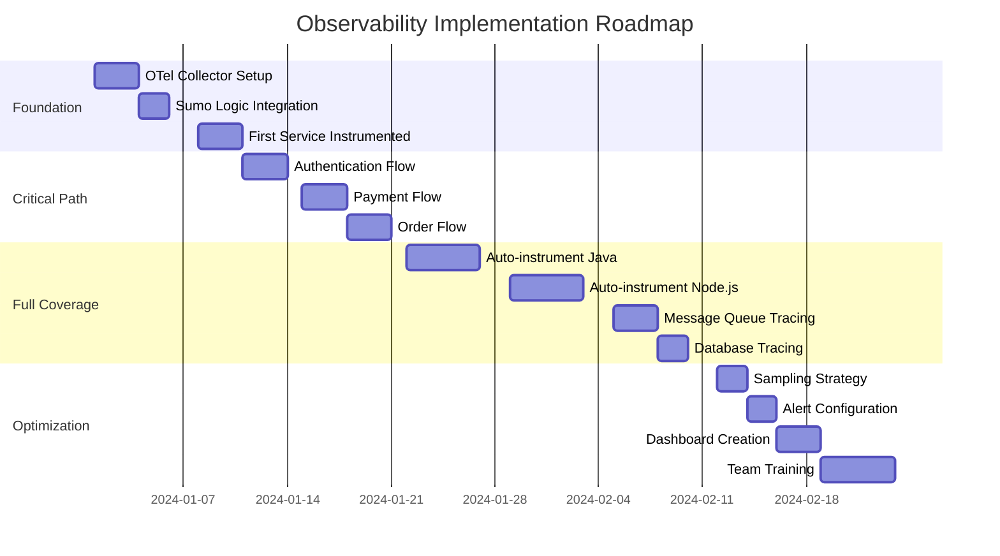

# Observability Adoption Guide: From Broken Traces to Full-Stack Visibility

## Executive Summary

This guide addresses the critical challenge of broken distributed tracing in microservices architectures. It provides a pragmatic approach to implementing OpenTelemetry (OTel) standards, W3C Trace Context propagation, and achieving true end-to-end observability from SPA to database, with initial focus on tracing to Sumo Logic and future metrics integration with New Relic.

---

## Table of Contents
1. [The Broken Trace Problem](#the-broken-trace-problem)
2. [OpenTelemetry Foundation](#opentelemetry-foundation)
3. [W3C Trace Context Standard](#w3c-trace-context-standard)
4. [Implementation Strategy](#implementation-strategy)
5. [Tech Stack Integration Patterns](#tech-stack-integration-patterns)
6. [Zero-Code Instrumentation](#zero-code-instrumentation)
7. [Trace Propagation Patterns](#trace-propagation-patterns)
8. [Sumo Logic Integration](#sumo-logic-integration)
9. [Migration Roadmap](#migration-roadmap)
10. [Operational Excellence](#operational-excellence)

---

## The Broken Trace Problem

### Current State: The Observability Nightmare

```yaml
Your Current Reality:
  - User reports issue at 2:00 PM
  - Support creates ticket at 2:15 PM
  - Engineer starts investigating at 3:00 PM
  - Searches 20 different log files
  - Correlates timestamps manually
  - Finds root cause at 6:00 PM (maybe)
  - Total time: 4 hours of manual correlation
```

### Why Traces Break in Microservices

```
User Journey Without Proper Tracing:
┌─────────────────────────────────────────────────────────┐
│  SPA (React)                                            │
│  TraceID: undefined ❌                                   │
└────────────────────┬────────────────────────────────────┘
                     │ HTTP Request
                     ↓
┌─────────────────────────────────────────────────────────┐
│  BFF (Node.js)                                          │
│  TraceID: Generated here 'abc123' ✓                    │
│  But doesn't propagate to logs ❌                       │
└────────────────────┬────────────────────────────────────┘
                     │ HTTP Request (no trace header)
                     ↓
┌─────────────────────────────────────────────────────────┐
│  API Gateway (Kong)                                     │
│  TraceID: Generates new one 'xyz789' ❌                 │
│  Previous trace lost!                                   │
└────────────────────┬────────────────────────────────────┘
                     │
           ┌─────────┴─────────┬──────────────┐
           ↓                   ↓              ↓
┌──────────────────┐ ┌──────────────┐ ┌──────────────┐
│ Service A (Java) │ │ Service B    │ │ Service C    │
│ TraceID: none ❌  │ │ TraceID: new │ │ TraceID: new │
└──────────────────┘ └──────────────┘ └──────────────┘
           ↓                   ↓              ↓
┌─────────────────────────────────────────────────────────┐
│  Message Queue (Kafka)                                  │
│  TraceID: Not in headers ❌                             │
└─────────────────────────────────────────────────────────┘
                     ↓
┌─────────────────────────────────────────────────────────┐
│  Database (PostgreSQL)                                  │
│  TraceID: What's a trace? ❌                            │
└─────────────────────────────────────────────────────────┘

Result: 7 different "traces" for 1 user request! 🤯
```

### The Cost of Broken Traces

```yaml
Quantifiable Impact:
  
  Debugging Time:
    Without traces: 4-8 hours average
    With traces: 5-30 minutes
    Time saved: 87.5% reduction
    
  Incident Resolution:
    MTTD (Mean Time To Detect): 45 minutes → 5 minutes
    MTTR (Mean Time To Resolve): 4 hours → 30 minutes
    Customer impact: 87.5% reduction
    
  Engineering Cost:
    Weekly debugging hours: 200 (across teams)
    With proper tracing: 25 hours
    Hours saved: 175 per week
    Annual savings: $910,000 (@$100/hour)
    
  Compliance Risk:
    Audit requirement: Full transaction traceability
    Current state: FAIL ❌
    Potential fines: $100K-1M
```

---

## OpenTelemetry Foundation

### What is OpenTelemetry?

```yaml
OpenTelemetry (OTel):
  Definition: 
    Vendor-neutral standard for observability
    
  Components:
    - APIs: How to instrument code
    - SDKs: Language-specific implementations
    - Collectors: Receive, process, export telemetry
    - Protocol (OTLP): Standard wire protocol
    
  Three Pillars:
    1. Traces: Request flow through system
    2. Metrics: Numerical measurements
    3. Logs: Structured event records
    
  Why OTel Over Proprietary:
    ✓ Vendor neutral (no lock-in)
    ✓ Industry standard (CNCF project)
    ✓ Wide language support
    ✓ Auto-instrumentation available
    ✓ Future-proof investment
```

### OpenTelemetry Architecture for Your Stack

```
┌──────────────────────────────────────────────────────────┐
│                    Frontend (SPA)                        │
│              OTel JS SDK + W3C TraceContext              │
└─────────────────────┬────────────────────────────────────┘
                      │ traceparent header
                      ↓
┌──────────────────────────────────────────────────────────┐
│                    Load Balancer                         │
│                 (Pass through headers)                   │
└─────────────────────┬────────────────────────────────────┘
                      ↓
┌──────────────────────────────────────────────────────────┐
│                   API Gateway                            │
│            OTel Instrumentation + Propagation            │
└─────────────────────┬────────────────────────────────────┘
                      ↓
┌──────────────────────────────────────────────────────────┐
│                      BFF Layer                           │
│         OTel Auto-instrumentation (Node.js/Java)         │
└─────────────────────┬────────────────────────────────────┘
                      ↓
┌──────────────────────────────────────────────────────────┐
│                   Microservices                          │
│    OTel SDKs (Java, Python, Go, .NET) + Auto-inst       │
└─────────────────────┬────────────────────────────────────┘
                      ↓
┌──────────────────────────────────────────────────────────┐
│                  Message Queues                          │
│         Kafka/RabbitMQ with trace propagation            │
└─────────────────────┬────────────────────────────────────┘
                      ↓
┌──────────────────────────────────────────────────────────┐
│                    Databases                             │
│           Query comments with trace context              │
└──────────────────────────────────────────────────────────┘
                      ↓
┌──────────────────────────────────────────────────────────┐
│                  OTel Collector                          │
│          Process, Sample, Transform, Route               │
└─────────────────────┬────────────────────────────────────┘
                      ↓
        ┌─────────────┴─────────────┐
        ↓                           ↓
┌──────────────┐           ┌──────────────┐
│  Sumo Logic  │           │  New Relic   │
│   (Traces)   │           │  (Metrics)   │
└──────────────┘           └──────────────┘
```

---

## W3C Trace Context Standard

### Understanding traceparent Header

```yaml
W3C Trace Context Format:
  traceparent: version-trace_id-parent_id-trace_flags
  
  Example:
    traceparent: 00-4bf92f3577b34da6a3ce929d0e0e4736-00f067aa0ba902b7-01
    
  Breakdown:
    00: Version (always 00 currently)
    4bf92f3577b34da6a3ce929d0e0e4736: 128-bit Trace ID
    00f067aa0ba902b7: 64-bit Span ID
    01: Trace flags (01 = sampled)
    
  Why W3C Standard:
    ✓ HTTP header standard
    ✓ Works across all systems
    ✓ Vendor neutral
    ✓ Automatic propagation support
    ✓ Compatible with all OTel SDKs
```

### Implementing traceparent Propagation

#### Frontend (SPA) - Trace Origination

```javascript
// React/Vue/Angular - Install OTel Web SDK
import { WebTracerProvider } from '@opentelemetry/sdk-trace-web';
import { ZoneContextManager } from '@opentelemetry/context-zone';
import { FetchInstrumentation } from '@opentelemetry/instrumentation-fetch';
import { XMLHttpRequestInstrumentation } from '@opentelemetry/instrumentation-xml-http-request';
import { W3CTraceContextPropagator } from '@opentelemetry/core';

// Initialize tracing
const provider = new WebTracerProvider({
  resource: new Resource({
    [SemanticResourceAttributes.SERVICE_NAME]: 'frontend-spa',
    [SemanticResourceAttributes.SERVICE_VERSION]: '1.0.0',
  }),
});

// Configure W3C Trace Context propagation
provider.addSpanProcessor(new BatchSpanProcessor(new OTLPTraceExporter({
  url: 'https://collectors.sumologic.com/v1/traces',
  headers: {
    'X-Sumo-Fields': 'environment=prod,application=spa'
  }
})));

// Register instrumentations - automatic header injection!
registerInstrumentations({
  instrumentations: [
    new FetchInstrumentation({
      propagateTraceHeaderCorsUrls: [
        'https://api.company.com',
        'https://bff.company.com'
      ],
      clearTimingResources: true,
    }),
    new XMLHttpRequestInstrumentation({
      propagateTraceHeaderCorsUrls: [
        'https://api.company.com',
        'https://bff.company.com'
      ],
    }),
  ],
});

provider.register({
  contextManager: new ZoneContextManager(),
  propagator: new W3CTraceContextPropagator(),
});

// Now ALL HTTP requests automatically include traceparent header!
// Example: traceparent: 00-4bf92f3577b34da6a3ce929d0e0e4736-00f067aa0ba902b7-01
```

#### BFF Layer - Trace Continuation

```javascript
// Node.js BFF - Zero-code instrumentation approach
// package.json
{
  "scripts": {
    "start": "node -r ./tracing.js app.js"
  },
  "dependencies": {
    "@opentelemetry/api": "^1.4.0",
    "@opentelemetry/auto-instrumentations-node": "^0.37.0",
    "@opentelemetry/exporter-trace-otlp-http": "^0.38.0",
    "@opentelemetry/sdk-node": "^0.38.0"
  }
}

// tracing.js - Loaded before app starts
const { NodeSDK } = require('@opentelemetry/sdk-node');
const { getNodeAutoInstrumentations } = require('@opentelemetry/auto-instrumentations-node');
const { OTLPTraceExporter } = require('@opentelemetry/exporter-trace-otlp-http');
const { W3CTraceContextPropagator } = require('@opentelemetry/core');

const sdk = new NodeSDK({
  traceExporter: new OTLPTraceExporter({
    url: 'https://collectors.sumologic.com/v1/traces',
    headers: {
      'X-Sumo-Fields': 'environment=prod,application=bff'
    },
  }),
  instrumentations: [
    getNodeAutoInstrumentations({
      '@opentelemetry/instrumentation-fs': {
        enabled: false, // Disable noisy fs instrumentation
      },
    }),
  ],
  textMapPropagator: new W3CTraceContextPropagator(),
});

sdk.start();

// Your Express app - NO CODE CHANGES NEEDED!
const express = require('express');
const app = express();

app.get('/api/user/:id', async (req, res) => {
  // traceparent automatically extracted from headers
  // All downstream HTTP calls automatically include it
  const userData = await fetchUserFromAPI(req.params.id);
  res.json(userData);
});
```

#### Java Microservices - Auto-instrumentation

```yaml
# Dockerfile - Add Java agent
FROM openjdk:11-jre-slim
COPY app.jar /app.jar
# Download OpenTelemetry Java agent
ADD https://github.com/open-telemetry/opentelemetry-java-instrumentation/releases/latest/download/opentelemetry-javaagent.jar /opentelemetry-javaagent.jar

# Environment variables for configuration
ENV OTEL_SERVICE_NAME=user-service
ENV OTEL_EXPORTER_OTLP_ENDPOINT=https://collectors.sumologic.com
ENV OTEL_EXPORTER_OTLP_HEADERS="X-Sumo-Fields=environment=prod,application=user-service"
ENV OTEL_PROPAGATORS=tracecontext,baggage
ENV OTEL_TRACES_EXPORTER=otlp

# Start with agent - ZERO CODE CHANGES!
ENTRYPOINT ["java", "-javaagent:/opentelemetry-javaagent.jar", "-jar", "/app.jar"]
```

```java
// Your Spring Boot application - NO CHANGES NEEDED!
@RestController
public class UserController {
    @Autowired
    private UserService userService;
    
    @GetMapping("/user/{id}")
    public User getUser(@PathVariable String id) {
        // traceparent automatically propagated from incoming request
        // All downstream calls (HTTP, JDBC, Redis, etc.) auto-instrumented
        return userService.findById(id);
    }
}

// Even database queries are traced!
@Repository
public class UserRepository {
    @Autowired
    private JdbcTemplate jdbcTemplate;
    
    public User findById(String id) {
        // SQL query automatically includes trace context as comment
        // SELECT * FROM users WHERE id = ? /* traceparent=00-4bf92... */
        return jdbcTemplate.queryForObject(
            "SELECT * FROM users WHERE id = ?",
            new Object[]{id},
            new UserRowMapper()
        );
    }
}
```

#### Python Services - Auto-instrumentation

```python
# requirements.txt
opentelemetry-distro==0.38b0
opentelemetry-exporter-otlp==1.17.0
opentelemetry-instrumentation-fastapi==0.38b0
opentelemetry-instrumentation-requests==0.38b0
opentelemetry-instrumentation-sqlalchemy==0.38b0

# Dockerfile
FROM python:3.9-slim
COPY requirements.txt .
RUN pip install -r requirements.txt
RUN opentelemetry-bootstrap --action=install  # Auto-detect and install instrumentations
COPY app.py .

ENV OTEL_SERVICE_NAME=inventory-service
ENV OTEL_EXPORTER_OTLP_ENDPOINT=https://collectors.sumologic.com
ENV OTEL_EXPORTER_OTLP_HEADERS="X-Sumo-Fields=environment=prod"
ENV OTEL_PROPAGATORS=tracecontext,baggage

# Start with auto-instrumentation
CMD ["opentelemetry-instrument", "python", "app.py"]
```

```python
# app.py - Your FastAPI app with NO CHANGES
from fastapi import FastAPI
import requests
import sqlalchemy

app = FastAPI()

@app.get("/inventory/{product_id}")
async def get_inventory(product_id: str):
    # traceparent automatically extracted and propagated!
    
    # External HTTP call - auto-traced
    supplier_data = requests.get(f"http://supplier-api/stock/{product_id}")
    
    # Database query - auto-traced
    db.execute(f"SELECT quantity FROM inventory WHERE product_id = {product_id}")
    
    return {"product_id": product_id, "quantity": quantity}
```

---

## Implementation Strategy

### Phase 1: Foundation (Week 1-2)

```yaml
Goals:
  - Setup OTel Collector infrastructure
  - Configure Sumo Logic backend
  - Implement first service with tracing
  - Validate end-to-end flow
  
Tasks:
  1. Deploy OTel Collector:
     - Kubernetes DaemonSet or Sidecar
     - Configure OTLP receivers
     - Setup Sumo Logic exporter
     
  2. Instrument Entry Points:
     - Frontend SPA
     - API Gateway
     - Load Balancers (header preservation)
     
  3. Pick Pilot Service:
     - High-value service
     - Well-understood flow
     - Team buy-in
     
  4. Validate:
     - Trace appears in Sumo Logic
     - Context propagates correctly
     - Performance impact acceptable
```

#### OTel Collector Configuration

```yaml
# otel-collector-config.yaml
receivers:
  otlp:
    protocols:
      grpc:
        endpoint: 0.0.0.0:4317
      http:
        endpoint: 0.0.0.0:4318
        cors:
          allowed_origins:
            - "https://*.company.com"
          allowed_headers:
            - "*"
  
  # Receive traces from various sources
  jaeger:
    protocols:
      grpc:
        endpoint: 0.0.0.0:14250
      thrift_http:
        endpoint: 0.0.0.0:14268
  
  zipkin:
    endpoint: 0.0.0.0:9411

processors:
  batch:
    timeout: 1s
    send_batch_size: 1024
  
  memory_limiter:
    check_interval: 1s
    limit_mib: 512
  
  # Add trace metadata
  attributes:
    actions:
      - key: environment
        value: production
        action: upsert
      - key: collector.version
        value: "1.0.0"
        action: upsert
  
  # Sampling (start with 100%, reduce later)
  probabilistic_sampler:
    sampling_percentage: 100

exporters:
  # Primary: Sumo Logic for traces
  sumologic:
    endpoint: https://collectors.sumologic.com/v1/traces
    headers:
      X-Sumo-Fields: "cluster=prod,team=platform"
    sending_queue:
      enabled: true
      num_consumers: 10
      queue_size: 5000
  
  # Future: New Relic for metrics
  otlp/newrelic:
    endpoint: https://otlp.nr-data.net:4317
    headers:
      api-key: ${NEW_RELIC_API_KEY}
  
  # Debug: Local logging
  logging:
    loglevel: info
    sampling_initial: 5
    sampling_thereafter: 200

service:
  pipelines:
    traces:
      receivers: [otlp, jaeger, zipkin]
      processors: [memory_limiter, batch, attributes]
      exporters: [sumologic, logging]
    
    # Future: metrics pipeline
    metrics:
      receivers: [otlp]
      processors: [memory_limiter, batch]
      exporters: [otlp/newrelic]
```

### Phase 2: Critical Path Coverage (Week 3-4)

```yaml
Priority Order:
  1. User Authentication Flow:
     - SPA → BFF → Auth Service → Database
     - Most critical for debugging
     
  2. Payment Processing:
     - SPA → BFF → Payment Service → Payment Gateway
     - Compliance requirement
     
  3. Order Fulfillment:
     - SPA → BFF → Order Service → Inventory → Shipping
     - Complex flow needing visibility
     
  4. Search and Browse:
     - SPA → BFF → Search Service → ElasticSearch
     - Performance critical
```

### Phase 3: Full Coverage (Week 5-8)

```yaml
Rollout Strategy:
  
  Week 5-6: High-Traffic Services
    - Auto-instrumentation for all Java services
    - Auto-instrumentation for all Node.js services
    - Manual instrumentation for Go services
    
  Week 7: Async Flows
    - Kafka message tracing
    - RabbitMQ tracing
    - Background job tracing
    
  Week 8: Database Layer
    - Query comment injection
    - Slow query correlation
    - Connection pool metrics
```

---

## Tech Stack Integration Patterns

### Message Queue & Event Streaming Tracing

Your architecture uses three different messaging solutions across generations. Here's how to implement tracing for each:

#### Kafka Tracing (V1 - Legacy)

```java
// Producer - Inject trace context into Kafka headers
@Component
public class TracedKafkaProducer {
    @Autowired
    private KafkaTemplate<String, Object> kafkaTemplate;
    
    public void sendMessage(String topic, Object message) {
        // OpenTelemetry automatically injects traceparent into headers!
        ProducerRecord<String, Object> record = new ProducerRecord<>(topic, message);
        
        // Auto-instrumentation handles this, but manual example:
        Span span = GlobalOpenTelemetry.getTracer("kafka-producer")
            .spanBuilder("kafka.send")
            .setAttribute("messaging.system", "kafka")
            .setAttribute("messaging.destination", topic)
            .setAttribute("messaging.kafka.partition", record.partition())
            .startSpan();
        
        try (Scope scope = span.makeCurrent()) {
            // Trace context automatically added to headers
            kafkaTemplate.send(record);
        } finally {
            span.end();
        }
    }
}

// Consumer - Extract trace context from Kafka headers
@Component
public class TracedKafkaConsumer {
    @KafkaListener(topics = "orders")
    public void processOrder(ConsumerRecord<String, String> record) {
        // OpenTelemetry automatically extracts traceparent from headers!
        // Continues the trace from producer
        
        // Extract trace manually if needed
        String traceParent = new String(record.headers()
            .lastHeader("traceparent").value());
        
        // Your business logic - fully traced
        processOrderLogic(record.value());
    }
}

// Kafka Streams - Trace propagation through stream processing
@Component
public class TracedKafkaStreams {
    public void setupStreams(StreamsBuilder builder) {
        builder.stream("input-topic")
            .transformValues(() -> new ValueTransformer<String, String>() {
                private ProcessorContext context;
                
                @Override
                public void init(ProcessorContext context) {
                    this.context = context;
                }
                
                @Override
                public String transform(String value) {
                    // Trace context preserved through transformation
                    Headers headers = context.headers();
                    String traceParent = new String(headers.lastHeader("traceparent").value());
                    
                    Span span = GlobalOpenTelemetry.getTracer("kafka-streams")
                        .spanBuilder("stream.transform")
                        .setParent(Context.current().with(Span.wrap(
                            SpanContext.createFromRemoteParent(traceParent, ...))))
                        .startSpan();
                    
                    try {
                        return processValue(value);
                    } finally {
                        span.end();
                    }
                }
            })
            .to("output-topic");
    }
}
```

#### AWS Kinesis Tracing (V2 - Current)

```python
# Python Kinesis Producer with trace propagation
import json
import boto3
from opentelemetry import trace, propagate
from opentelemetry.trace.propagation.tracecontext import TraceContextTextMapPropagator

class TracedKinesisProducer:
    def __init__(self):
        self.kinesis = boto3.client('kinesis')
        self.tracer = trace.get_tracer(__name__)
        self.propagator = TraceContextTextMapPropagator()
    
    def send_record(self, stream_name, data, partition_key):
        with self.tracer.start_as_current_span("kinesis.put_record") as span:
            # Add trace context to the record
            carrier = {}
            self.propagator.inject(carrier)
            
            # Include trace context in the data payload
            enriched_data = {
                'trace_context': {
                    'traceparent': carrier.get('traceparent'),
                    'tracestate': carrier.get('tracestate')
                },
                'original_data': data,
                'timestamp': datetime.utcnow().isoformat()
            }
            
            # Send to Kinesis
            response = self.kinesis.put_record(
                StreamName=stream_name,
                Data=json.dumps(enriched_data),
                PartitionKey=partition_key
            )
            
            # Add Kinesis-specific attributes
            span.set_attribute("messaging.system", "aws_kinesis")
            span.set_attribute("messaging.destination", stream_name)
            span.set_attribute("aws.kinesis.shard_id", response['ShardId'])
            span.set_attribute("aws.kinesis.sequence_number", response['SequenceNumber'])
            
            return response
```

```java
// Java Kinesis Consumer with trace extraction
@Component
public class TracedKinesisConsumer {
    private final Tracer tracer = GlobalOpenTelemetry.getTracer("kinesis-consumer");
    
    @KinesisListener(stream = "my-stream")
    public void processRecord(KinesisClientRecord record) {
        // Parse the record
        String data = new String(record.data().array(), StandardCharsets.UTF_8);
        JsonNode payload = objectMapper.readTree(data);
        
        // Extract trace context from payload
        String traceParent = payload.get("trace_context").get("traceparent").asText();
        
        // Create span with parent context
        SpanContext parentContext = W3CTraceContextPropagator.getInstance()
            .extract(Context.current(), 
                     Collections.singletonMap("traceparent", traceParent),
                     TextMapGetter.defaultGetter());
        
        Span span = tracer.spanBuilder("kinesis.process")
            .setParent(Context.current().with(Span.wrap(parentContext)))
            .setAttribute("messaging.system", "aws_kinesis")
            .setAttribute("messaging.operation", "process")
            .setAttribute("aws.kinesis.stream", "my-stream")
            .setAttribute("aws.kinesis.partition_key", record.partitionKey())
            .startSpan();
        
        try (Scope scope = span.makeCurrent()) {
            // Process the record with trace context
            processBusinessLogic(payload.get("original_data"));
        } catch (Exception e) {
            span.recordException(e);
            span.setStatus(StatusCode.ERROR);
            throw e;
        } finally {
            span.end();
        }
    }
}

// Kinesis Data Analytics (KDA) with tracing
public class TracedKinesisAnalytics extends DataStream<String> {
    @Override
    public void processElement(StreamRecord<String> record) {
        // Extract trace from Kinesis record
        JsonNode data = parseRecord(record);
        String traceParent = data.get("trace_context").get("traceparent").asText();
        
        // Continue trace through analytics
        Span span = createSpanWithParent(traceParent, "kda.process");
        
        try (Scope scope = span.makeCurrent()) {
            // Your analytics logic
            DataStream<String> result = record
                .map(this::transform)
                .filter(this::filterLogic)
                .keyBy(this::getKey)
                .window(TumblingEventTimeWindows.of(Time.minutes(5)))
                .aggregate(new TracedAggregateFunction());
            
            // Output maintains trace context
            result.addSink(new TracedKinesisSink());
        } finally {
            span.end();
        }
    }
}
```

#### AWS EventBridge Tracing (V3 - New Generation)

```typescript
// TypeScript/Node.js EventBridge Producer with tracing
import { EventBridgeClient, PutEventsCommand } from "@aws-sdk/client-eventbridge";
import { trace, context, SpanStatusCode } from '@opentelemetry/api';
import { W3CTraceContextPropagator } from '@opentelemetry/core';

class TracedEventBridgeProducer {
    private client: EventBridgeClient;
    private tracer = trace.getTracer('eventbridge-producer');
    private propagator = new W3CTraceContextPropagator();
    
    async sendEvent(eventBusName: string, source: string, detailType: string, detail: any) {
        const span = this.tracer.startSpan('eventbridge.put_event', {
            attributes: {
                'messaging.system': 'aws_eventbridge',
                'messaging.destination': eventBusName,
                'aws.eventbridge.source': source,
                'aws.eventbridge.detail_type': detailType
            }
        });
        
        return context.with(trace.setSpan(context.active(), span), async () => {
            try {
                // Inject trace context into event detail
                const carrier: Record<string, string> = {};
                this.propagator.inject(context.active(), carrier);
                
                // Enrich event with trace context
                const enrichedDetail = {
                    traceContext: {
                        traceparent: carrier.traceparent,
                        tracestate: carrier.tracestate
                    },
                    correlationId: span.spanContext().traceId,
                    timestamp: new Date().toISOString(),
                    ...detail
                };
                
                // Send to EventBridge
                const command = new PutEventsCommand({
                    Entries: [{
                        EventBusName: eventBusName,
                        Source: source,
                        DetailType: detailType,
                        Detail: JSON.stringify(enrichedDetail),
                        // Add trace ID as a trackable attribute
                        TraceHeader: carrier.traceparent
                    }]
                });
                
                const response = await this.client.send(command);
                
                // Add response metadata
                span.setAttribute('aws.eventbridge.event_id', response.Entries?.[0]?.EventId || '');
                span.setStatus({ code: SpanStatusCode.OK });
                
                return response;
            } catch (error) {
                span.recordException(error as Error);
                span.setStatus({ code: SpanStatusCode.ERROR });
                throw error;
            } finally {
                span.end();
            }
        });
    }
}

// Lambda function consuming EventBridge events with trace continuation
export const tracedEventHandler = async (event: EventBridgeEvent): Promise<void> => {
    const tracer = trace.getTracer('eventbridge-consumer');
    
    // Parse the detail to get trace context
    const detail = typeof event.detail === 'string' 
        ? JSON.parse(event.detail) 
        : event.detail;
    
    // Extract trace context
    const traceContext = detail.traceContext || {};
    const parentContext = propagator.extract(
        context.active(),
        traceContext
    );
    
    // Start span with parent context
    const span = tracer.startSpan('eventbridge.process', {
        attributes: {
            'messaging.system': 'aws_eventbridge',
            'messaging.operation': 'process',
            'aws.eventbridge.source': event.source,
            'aws.eventbridge.detail_type': event['detail-type'],
            'aws.eventbridge.event_id': event.id,
            'aws.eventbridge.rule': event.resources?.[0]
        }
    }, parentContext);
    
    return context.with(trace.setSpan(context.active(), span), async () => {
        try {
            // Process event with full trace context
            await processBusinessLogic(detail);
            
            // If this triggers other AWS services, trace continues
            if (detail.requiresDownstream) {
                await sendToSQS(detail);  // Trace propagated automatically
                await writeToS3(detail);  // Trace propagated automatically
                await invokeLambda(detail); // Trace propagated automatically
            }
            
            span.setStatus({ code: SpanStatusCode.OK });
        } catch (error) {
            span.recordException(error as Error);
            span.setStatus({ code: SpanStatusCode.ERROR });
            throw error;
        } finally {
            span.end();
        }
    });
};

// EventBridge Rule with Lambda target - CloudFormation
const eventBridgeRuleWithTracing = {
    Type: 'AWS::Events::Rule',
    Properties: {
        EventBusName: 'my-event-bus',
        EventPattern: {
            source: ['my.application'],
            'detail-type': ['OrderCreated', 'OrderUpdated']
        },
        Targets: [{
            Arn: lambdaFunctionArn,
            // Enable X-Ray tracing for automatic AWS service correlation
            HttpParameters: {
                HeaderParameters: {
                    'X-Amzn-Trace-Id': '$.detail.traceContext.traceparent'
                }
            }
        }]
    }
};
```

#### Hybrid Messaging Architecture - Cross-System Tracing

```python
# Python service that bridges Kafka → Kinesis → EventBridge
class HybridMessageTracer:
    def __init__(self):
        self.tracer = trace.get_tracer(__name__)
        self.kafka_consumer = KafkaConsumer('legacy-topic')
        self.kinesis_producer = boto3.client('kinesis')
        self.eventbridge_client = boto3.client('events')
    
    async def bridge_message_with_trace(self):
        """Maintains trace context across all three messaging systems"""
        
        # 1. Consume from Kafka with trace
        for message in self.kafka_consumer:
            # Extract trace from Kafka headers
            trace_parent = message.headers.get('traceparent')
            
            # Continue trace
            ctx = self.propagator.extract(
                carrier={'traceparent': trace_parent}
            )
            
            with self.tracer.start_as_current_span(
                "message.bridge",
                context=ctx
            ) as span:
                span.set_attribute("messaging.bridge.flow", "kafka→kinesis→eventbridge")
                
                # 2. Send to Kinesis (V2 systems)
                kinesis_record = self.prepare_kinesis_record(message.value)
                kinesis_response = await self.send_to_kinesis(kinesis_record)
                
                # 3. Send to EventBridge (V3 systems)
                event = self.prepare_eventbridge_event(message.value)
                eventbridge_response = await self.send_to_eventbridge(event)
                
                span.set_attribute("bridge.kafka.offset", message.offset)
                span.set_attribute("bridge.kinesis.sequence", kinesis_response['SequenceNumber'])
                span.set_attribute("bridge.eventbridge.id", eventbridge_response['Entries'][0]['EventId'])
```

#### Comparison of Messaging Tracing Patterns

| Messaging System | Trace Storage | Propagation Method | Auto-Instrumentation | Considerations |
|-----------------|---------------|-------------------|---------------------|----------------|
| **Kafka** | Message Headers | Native header support | Yes (Java, Python, Node.js) | Headers preserved through topics |
| **Kinesis** | Message Payload | JSON field in data | Partial (AWS SDK) | Must embed in payload, size limits |
| **EventBridge** | Event Detail | JSON field in detail | Via AWS X-Ray | 256KB detail limit, rule filtering |
```

### Database Query Tracing

```sql
-- PostgreSQL - Trace context in query comments
SELECT * FROM users WHERE id = 123 
/* traceparent='00-4bf92f3577b34da6a3ce929d0e0e4736-00f067aa0ba902b7-01' */;

-- MySQL - Same pattern
SELECT * FROM orders WHERE user_id = 456
/* traceparent='00-4bf92f3577b34da6a3ce929d0e0e4736-00f067aa0ba902b7-01' */;

-- Enable in PostgreSQL logs
ALTER SYSTEM SET log_statement = 'all';
ALTER SYSTEM SET log_duration = on;
SELECT pg_reload_conf();
```

```python
# SQLAlchemy with automatic comment injection
from opentelemetry.instrumentation.sqlalchemy import SQLAlchemyInstrumentor

# Auto-instrument SQLAlchemy
SQLAlchemyInstrumentor().instrument(
    engine=engine,
    enable_commenter=True,  # Injects trace context as SQL comments
    commenter_options={
        "opentelemetry_values": True,
    }
)

# Now all queries include trace context!
result = session.query(User).filter(User.id == user_id).first()
# Executed SQL: SELECT * FROM users WHERE id = ? /* traceparent=... */
```

### GraphQL Tracing

```javascript
// Apollo Server with OpenTelemetry
const { ApolloServer } = require('apollo-server');
const { ApolloServerPluginLandingPageGraphQLPlayground } = require('apollo-server-core');

const server = new ApolloServer({
  typeDefs,
  resolvers,
  plugins: [
    // OpenTelemetry plugin for Apollo
    {
      requestDidStart() {
        return {
          willSendResponse(requestContext) {
            // Trace context automatically propagated
            const span = trace.getActiveSpan();
            span?.setAttribute('graphql.operation', requestContext.request.operationName);
            span?.setAttribute('graphql.document', requestContext.request.query);
          }
        };
      }
    }
  ],
});
```

---

## Zero-Code Instrumentation

### Language-Specific Auto-Instrumentation

#### Java (Spring Boot)

```bash
# Download agent once
wget https://github.com/open-telemetry/opentelemetry-java-instrumentation/releases/latest/download/opentelemetry-javaagent.jar

# Add to JVM args - that's it!
java -javaagent:./opentelemetry-javaagent.jar \
     -Dotel.service.name=my-service \
     -Dotel.exporter.otlp.endpoint=http://collector:4317 \
     -jar my-application.jar

# Auto-instruments:
# - Spring WebMVC/WebFlux
# - JDBC (all drivers)
# - Redis (Jedis, Lettuce)
# - Kafka
# - HTTP clients (OkHttp, Apache HttpClient)
# - gRPC
# - AWS SDK
# - And 100+ more libraries!
```

#### Node.js

```bash
# Install dependencies
npm install --save @opentelemetry/api
npm install --save @opentelemetry/auto-instrumentations-node

# Start with instrumentation - no code changes!
node --require ./tracing.js app.js

# Auto-instruments:
# - Express/Koa/Fastify
# - HTTP/HTTPS
# - MySQL/PostgreSQL/MongoDB
# - Redis
# - GraphQL
# - AWS SDK
# - And more!
```

#### Python

```bash
# Install and auto-detect instrumentations
pip install opentelemetry-distro
opentelemetry-bootstrap --action=install

# Run with auto-instrumentation
opentelemetry-instrument \
    --service_name my-service \
    --exporter_otlp_endpoint http://collector:4317 \
    python app.py

# Auto-instruments:
# - Django/Flask/FastAPI
# - Requests/urllib3
# - SQLAlchemy/PyMongo
# - Celery
# - Redis
# - boto3/botocore
# - And more!
```

#### .NET

```csharp
// Program.cs - Add these lines, that's it!
using OpenTelemetry.Trace;
using OpenTelemetry.Resources;

var builder = WebApplication.CreateBuilder(args);

// Add OpenTelemetry
builder.Services.AddOpenTelemetryTracing(builder =>
{
    builder
        .SetResourceBuilder(ResourceBuilder.CreateDefault().AddService("my-service"))
        .AddAspNetCoreInstrumentation()
        .AddHttpClientInstrumentation()
        .AddSqlClientInstrumentation()
        .AddOtlpExporter(options =>
        {
            options.Endpoint = new Uri("http://collector:4317");
        });
});

// Rest of your app - no changes needed!
```

#### Go

```go
// main.go
package main

import (
    "go.opentelemetry.io/contrib/instrumentation/net/http/otelhttp"
    "go.opentelemetry.io/otel"
    "go.opentelemetry.io/otel/exporters/otlp/otlptrace/otlptracehttp"
)

func main() {
    // Setup tracing
    ctx := context.Background()
    exp, _ := otlptracehttp.New(ctx,
        otlptracehttp.WithEndpoint("collector:4318"),
    )
    
    tp := trace.NewTracerProvider(
        trace.WithBatcher(exp),
        trace.WithResource(resource.NewWithAttributes(
            semconv.ServiceNameKey.String("my-service"),
        )),
    )
    otel.SetTracerProvider(tp)
    otel.SetTextMapPropagator(propagation.TraceContext{})
    
    // Wrap your HTTP handlers
    http.Handle("/", otelhttp.NewHandler(
        http.HandlerFunc(yourHandler), 
        "HTTP",
    ))
}
```

---

## Trace Propagation Patterns

### Critical Propagation Points

```yaml
1. Frontend to Backend:
   Problem: CORS blocks traceparent header
   Solution:
     - Configure CORS to allow traceparent
     - Use OTel instrumentation with propagateTraceHeaderCorsUrls
     
2. Through Load Balancers:
   Problem: LB strips unknown headers
   Solution:
     - Configure LB to preserve traceparent header
     - Add to allowed headers list
     
3. Across Async Boundaries:
   Problem: Thread context lost
   Solution:
     - Use Context propagation libraries
     - Store trace context in message headers
     
4. Through Caches:
   Problem: Cached responses lose trace
   Solution:
     - Include trace context in cache key
     - Add trace metadata to cached response
     
5. Database Queries:
   Problem: SQL doesn't support headers
   Solution:
     - Inject as SQL comments
     - Parse from database logs
```

### Multi-Generation Messaging Architecture Challenges

```yaml
Your Messaging Evolution:
  V1 (Legacy): Kafka
    - Still processing 40% of events
    - Tightly coupled producers/consumers
    - Header-based trace propagation
    
  V2 (Current): Kinesis
    - Processing 50% of events
    - Better AWS integration
    - Payload-based trace propagation
    
  V3 (New): EventBridge
    - Processing 10% of events (growing)
    - Event-driven architecture
    - Rule-based routing
    - Native AWS service integration

Cross-Generation Challenges:
  1. Different trace propagation methods
  2. Multiple monitoring systems
  3. Mixed auto-instrumentation support
  4. Varying latency characteristics
  5. Different failure modes
```

#### Unified Tracing Strategy for Multi-Generation Messaging

```python
# Unified message wrapper for cross-generation compatibility
from dataclasses import dataclass
from typing import Optional, Dict, Any
import json

@dataclass
class UnifiedMessage:
    """Standard message format across all messaging systems"""
    
    # Core message data
    id: str
    timestamp: str
    source_system: str  # 'kafka', 'kinesis', 'eventbridge'
    payload: Dict[str, Any]
    
    # Trace context (W3C standard)
    trace_parent: str
    trace_state: Optional[str] = None
    
    # Routing metadata
    target_systems: List[str] = field(default_factory=list)
    correlation_id: Optional[str] = None
    
    def to_kafka_record(self) -> ProducerRecord:
        """Convert to Kafka format with headers"""
        headers = [
            ('traceparent', self.trace_parent.encode()),
            ('source_system', self.source_system.encode()),
            ('correlation_id', self.correlation_id.encode() if self.correlation_id else b'')
        ]
        return ProducerRecord(
            topic='unified-events',
            value=json.dumps(self.payload).encode(),
            headers=headers
        )
    
    def to_kinesis_record(self) -> Dict:
        """Convert to Kinesis format with embedded trace"""
        return {
            'Data': json.dumps({
                'trace_context': {
                    'traceparent': self.trace_parent,
                    'tracestate': self.trace_state
                },
                'metadata': {
                    'id': self.id,
                    'source': self.source_system,
                    'correlation_id': self.correlation_id
                },
                'payload': self.payload
            }),
            'PartitionKey': self.correlation_id or self.id
        }
    
    def to_eventbridge_event(self) -> Dict:
        """Convert to EventBridge format with trace in detail"""
        return {
            'Source': f'unified.{self.source_system}',
            'DetailType': 'UnifiedMessage',
            'Detail': json.dumps({
                'traceContext': {
                    'traceparent': self.trace_parent,
                    'tracestate': self.trace_state
                },
                'messageId': self.id,
                'correlationId': self.correlation_id,
                'sourceSystem': self.source_system,
                'payload': self.payload
            })
        }

# Unified consumer that handles all three systems
class UnifiedMessageConsumer:
    def __init__(self):
        self.tracer = trace.get_tracer(__name__)
        
    def process_kafka_message(self, record: ConsumerRecord) -> UnifiedMessage:
        """Extract unified message from Kafka"""
        trace_parent = record.headers.get('traceparent', b'').decode()
        
        return UnifiedMessage(
            id=f"kafka-{record.offset}",
            timestamp=datetime.fromtimestamp(record.timestamp / 1000).isoformat(),
            source_system='kafka',
            payload=json.loads(record.value),
            trace_parent=trace_parent
        )
    
    def process_kinesis_record(self, record: KinesisRecord) -> UnifiedMessage:
        """Extract unified message from Kinesis"""
        data = json.loads(record['data'])
        
        return UnifiedMessage(
            id=record['sequenceNumber'],
            timestamp=record['approximateArrivalTimestamp'].isoformat(),
            source_system='kinesis',
            payload=data.get('payload', data),
            trace_parent=data.get('trace_context', {}).get('traceparent', '')
        )
    
    def process_eventbridge_event(self, event: Dict) -> UnifiedMessage:
        """Extract unified message from EventBridge"""
        detail = json.loads(event['detail']) if isinstance(event['detail'], str) else event['detail']
        
        return UnifiedMessage(
            id=event['id'],
            timestamp=event['time'],
            source_system='eventbridge',
            payload=detail.get('payload', detail),
            trace_parent=detail.get('traceContext', {}).get('traceparent', '')
        )
```

#### Migration Path: Kafka → Kinesis → EventBridge

```typescript
// Gradual migration service with full tracing
class MessagingMigrationService {
    private tracer = trace.getTracer('messaging-migration');
    
    async migrateWithDualWrite(message: any, migrationPhase: string) {
        const span = this.tracer.startSpan('message.migrate', {
            attributes: {
                'migration.phase': migrationPhase,
                'migration.strategy': 'dual-write'
            }
        });
        
        try {
            switch (migrationPhase) {
                case 'KAFKA_TO_KINESIS':
                    // Phase 1: Dual write to both systems
                    await Promise.all([
                        this.sendToKafka(message),    // Original
                        this.sendToKinesis(message)    // New
                    ]);
                    span.setAttribute('migration.dual_write', true);
                    break;
                    
                case 'KINESIS_TO_EVENTBRIDGE':
                    // Phase 2: Transition to EventBridge
                    await Promise.all([
                        this.sendToKinesis(message),      // Current
                        this.sendToEventBridge(message)   // Future
                    ]);
                    span.setAttribute('migration.target', 'eventbridge');
                    break;
                    
                case 'EVENTBRIDGE_ONLY':
                    // Phase 3: Fully migrated
                    await this.sendToEventBridge(message);
                    span.setAttribute('migration.complete', true);
                    break;
            }
        } finally {
            span.end();
        }
    }
}
```

### Testing Trace Propagation

```bash
#!/bin/bash
# Test script to verify trace propagation across all messaging systems

# Generate trace context
TRACE_ID=$(openssl rand -hex 16)
SPAN_ID=$(openssl rand -hex 8)
TRACEPARENT="00-${TRACE_ID}-${SPAN_ID}-01"

echo "Testing with traceparent: $TRACEPARENT"

# Test frontend endpoint
curl -H "traceparent: $TRACEPARENT" \
     -H "Content-Type: application/json" \
     https://app.company.com/api/test \
     -v 2>&1 | grep -i traceparent

# Check if trace appears in Sumo Logic
echo "Checking Sumo Logic for trace $TRACE_ID..."
curl -X POST https://api.sumologic.com/api/v1/search/jobs \
     -H "Authorization: Bearer $SUMO_API_KEY" \
     -d "{
       \"query\": \"trace_id=$TRACE_ID\",
       \"from\": \"2024-01-01T00:00:00\",
       \"to\": \"2024-12-31T23:59:59\"
     }"

# Validate propagation through all services
echo "Validating trace propagation..."
SERVICES=("frontend" "bff" "api-gateway" "user-service" "order-service")
for service in "${SERVICES[@]}"; do
    echo "Checking $service for trace $TRACE_ID"
    # Query service logs
done
```

---

## Sumo Logic Integration

### Configuring Sumo Logic for Traces

```yaml
Sumo Logic Setup:
  
  1. Create HTTP Traces Source:
     - Go to Sumo Logic > Setup > Collection
     - Add Collector > HTTP Traces
     - Note the endpoint URL
     
  2. Configure Source Category:
     - _sourceCategory: prod/traces
     - Fields: environment, service, version
     
  3. Setup Dashboards:
     - Service Map
     - Trace Timeline
     - Error Analysis
     - Latency Distribution
```

### Sumo Logic Trace Queries

```sql
-- Find all traces for a user
_sourceCategory=prod/traces
| parse "user_id=*" as user_id
| where user_id = "12345"
| timeslice 1m
| count by _timeslice, service_name

-- Find slow traces (>1 second)
_sourceCategory=prod/traces
| where duration > 1000
| fields trace_id, service_name, operation_name, duration
| sort by duration desc

-- Error traces
_sourceCategory=prod/traces
| where status_code >= 400 OR error = true
| fields trace_id, service_name, error_message, user_id
| top 100 service_name by error_count

-- Trace path analysis
_sourceCategory=prod/traces
| transaction on trace_id
| fields trace_id, service_path, total_duration
| where service_path contains "payment-service"
```

### Creating Sumo Logic Dashboards

```json
{
  "name": "Distributed Tracing Dashboard",
  "panels": [
    {
      "title": "Service Map",
      "query": "_sourceCategory=prod/traces | traceview",
      "type": "service-map"
    },
    {
      "title": "Request Rate by Service",
      "query": "_sourceCategory=prod/traces | timeslice 1m | count by _timeslice, service_name",
      "type": "line-chart"
    },
    {
      "title": "Error Rate",
      "query": "_sourceCategory=prod/traces | where error=true | timeslice 1m | count by _timeslice, service_name",
      "type": "stacked-bar"
    },
    {
      "title": "P99 Latency",
      "query": "_sourceCategory=prod/traces | pct(duration, 99) as p99 by service_name",
      "type": "bar-chart"
    },
    {
      "title": "Critical User Journeys",
      "query": "_sourceCategory=prod/traces | where operation_name in ('checkout', 'login', 'search') | stats avg(duration) by operation_name",
      "type": "table"
    }
  ]
}
```

---

## Migration Roadmap

### 8-Week Implementation Plan



### Week-by-Week Milestones

#### Week 1-2: Foundation
```yaml
Success Criteria:
  ✓ OTel Collector deployed in production
  ✓ Sumo Logic receiving traces
  ✓ First service fully instrumented
  ✓ End-to-end trace visible
  ✓ Team trained on basics
```

#### Week 3-4: Critical Paths
```yaml
Success Criteria:
  ✓ 3 critical user journeys traced
  ✓ Frontend to database visibility
  ✓ Error correlation working
  ✓ P99 latency baseline established
```

#### Week 5-6: Full Coverage
```yaml
Success Criteria:
  ✓ 80% of services instrumented
  ✓ All Java/Node.js services auto-instrumented
  ✓ Message queues traced
  ✓ Database queries correlated
```

#### Week 7-8: Operationalization
```yaml
Success Criteria:
  ✓ Sampling strategy implemented
  ✓ Alerts configured for anomalies
  ✓ Dashboards created for all teams
  ✓ Runbooks updated with trace queries
  ✓ 90% reduction in debug time demonstrated
```

---

## Operational Excellence

### Sampling Strategies

```yaml
Progressive Sampling Strategy:
  
  Week 1-2: 100% sampling
    - Capture everything during setup
    - Identify patterns and issues
    - Establish baseline
    
  Week 3-4: Head-based sampling
    - Sample 10% of normal traffic
    - 100% of errors
    - 100% of slow requests (>1s)
    
  Week 5+: Tail-based sampling
    - Intelligent sampling based on:
      - Error status
      - High latency
      - Specific users
      - Business transactions
```

```yaml
# OTel Collector tail sampling configuration
processors:
  tail_sampling:
    decision_wait: 10s
    num_traces: 100000
    policies:
      - name: errors-policy
        type: status_code
        status_code: {status_codes: [ERROR]}
        
      - name: latency-policy
        type: latency
        latency: {threshold_ms: 1000}
        
      - name: important-users
        type: string_attribute
        string_attribute: {key: user.tier, values: [premium, vip]}
        
      - name: probabilistic-policy
        type: probabilistic
        probabilistic: {sampling_percentage: 10}
```

### Alert Configuration

```yaml
Critical Alerts:
  
  1. Trace Propagation Broken:
     Condition: Service receiving <10% traces with parent
     Action: Page on-call engineer
     
  2. High Error Rate:
     Condition: Error rate >5% for 5 minutes
     Action: Alert team channel
     
  3. Latency Spike:
     Condition: P99 latency >2x baseline
     Action: Alert team channel
     
  4. Collector Down:
     Condition: No traces received for 2 minutes
     Action: Page platform team
```

### Cost Management

```yaml
Trace Volume Estimation:
  Requests per day: 10M
  Services per request: 5 average
  Spans per request: 20 average
  Total spans/day: 200M
  
  With 10% sampling: 20M spans/day
  
Sumo Logic Costs:
  Ingestion: $0.10 per GB
  Span size: ~1KB average
  Daily volume: 20GB
  Monthly cost: $60
  
  With intelligent sampling:
  - 100% errors: 1M spans/day
  - 100% slow: 500K spans/day
  - 10% normal: 1.85M spans/day
  - Total: 3.35M spans/day
  - Monthly cost: $10
  
Cost Optimization:
  1. Use tail-based sampling
  2. Drop unnecessary attributes
  3. Aggregate at collector level
  4. Use compression
  5. Set retention policies
```

---

## Success Metrics

### KPIs to Track

```yaml
Technical Metrics:
  - Trace coverage: Target 95% of services
  - Propagation success: Target >99%
  - Sampling efficiency: <$500/month
  - Query performance: <2s for trace lookup
  
Operational Metrics:
  - MTTD reduction: 90% (45min → 5min)
  - MTTR reduction: 87.5% (4hr → 30min)
  - Debug time reduction: 85%
  - False alert reduction: 70%
  
Business Metrics:
  - Customer impact minutes: -80%
  - Engineering productivity: +30%
  - Compliance requirements: 100% met
  - ROI: 10x in year 1
```

### Before and After Comparison

| Metric | Before | After | Improvement |
|--------|--------|-------|-------------|
| Find root cause | 4 hours | 15 minutes | 93.75% |
| Correlate logs | Manual | Automatic | ∞ |
| Trace user journey | Impossible | <30 seconds | ✓ |
| Debug async flows | 8 hours | 30 minutes | 93.75% |
| Compliance audit | 2 weeks | 2 hours | 99% |
| On-call stress | High | Low | Priceless |

---

## Common Pitfalls and Solutions

```yaml
Pitfall 1: Forgetting CORS Configuration
  Symptom: Frontend traces don't connect to backend
  Solution:
    - Add traceparent to Access-Control-Allow-Headers
    - Configure propagateTraceHeaderCorsUrls in OTel
    
Pitfall 2: Breaking Trace at Async Boundaries
  Symptom: New trace ID after queue/async operation
  Solution:
    - Pass trace context in message headers
    - Use context propagation libraries
    
Pitfall 3: Overwhelming Data Volume
  Symptom: High costs, slow queries
  Solution:
    - Implement intelligent sampling
    - Use tail-based sampling
    - Set retention policies
    
Pitfall 4: Missing Critical Services
  Symptom: Gaps in trace visualization
  Solution:
    - Audit all services
    - Prioritize by criticality
    - Use auto-instrumentation
    
Pitfall 5: Not Training Teams
  Symptom: Traces exist but unused
  Solution:
    - Conduct training sessions
    - Create query templates
    - Share success stories
```

---

## Conclusion

### The Journey to Full Observability

```yaml
Current State:
  - Broken traces
  - Manual correlation
  - 4+ hour debugging
  - Compliance risk
  
Target State (8 weeks):
  - Full trace propagation
  - Automatic correlation
  - <15 minute debugging
  - Compliance achieved
  
Investment Required:
  - 2 engineers for 8 weeks
  - ~$500/month for tools
  - Team training time
  
Return on Investment:
  - 175 hours/week saved
  - $910,000 annual savings
  - Compliance requirements met
  - Improved customer satisfaction
```

### Next Steps

1. **This Week:**
   - Deploy OTel Collector
   - Instrument first service
   - Configure Sumo Logic

2. **Next Month:**
   - Achieve 50% service coverage
   - Implement critical user journeys
   - Train teams on trace queries

3. **Quarter Goal:**
   - 95% service coverage
   - Full async flow tracing
   - Established sampling strategy
   - Operational dashboards

4. **Future Enhancements:**
   - Add metrics to New Relic
   - Implement log correlation
   - Add synthetic monitoring
   - Expand to edge locations

The path from broken traces to full observability is clear. With OpenTelemetry and W3C Trace Context, you'll transform debugging from archaeology to instant clarity.

---

*Document Version: 1.0*
*Last Updated: 2024*
*Owner: Platform Team*
*Questions: platform-team@company.com*